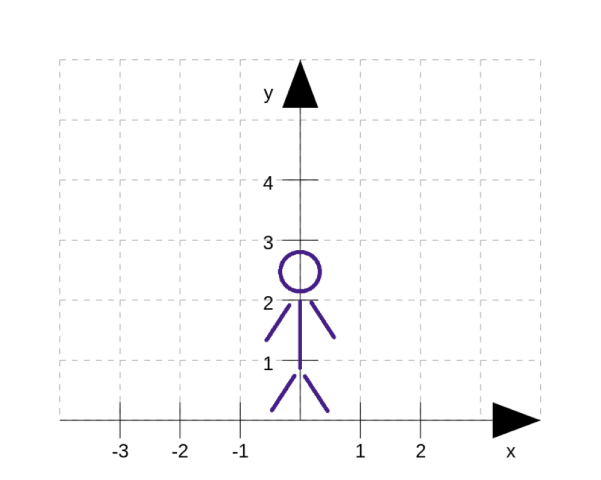
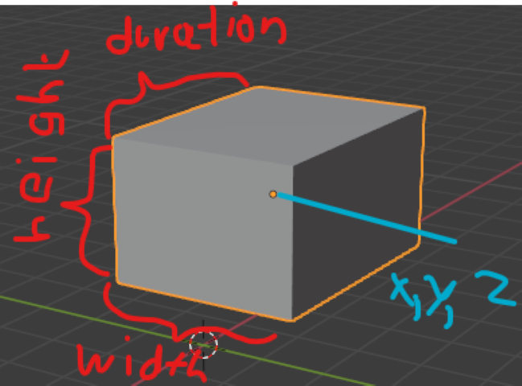
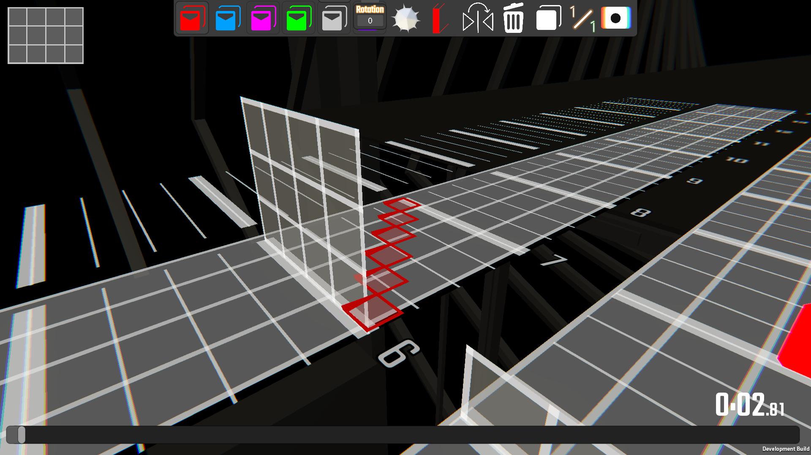
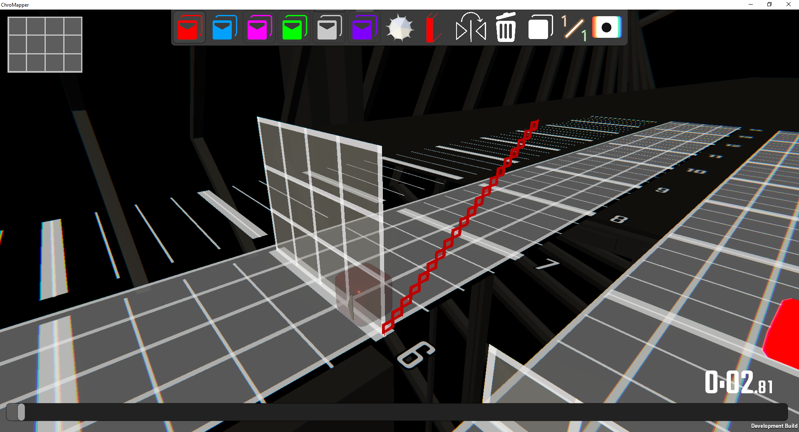
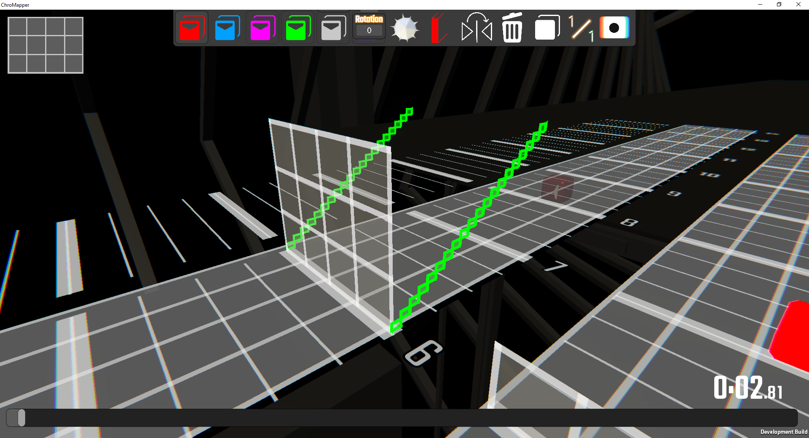
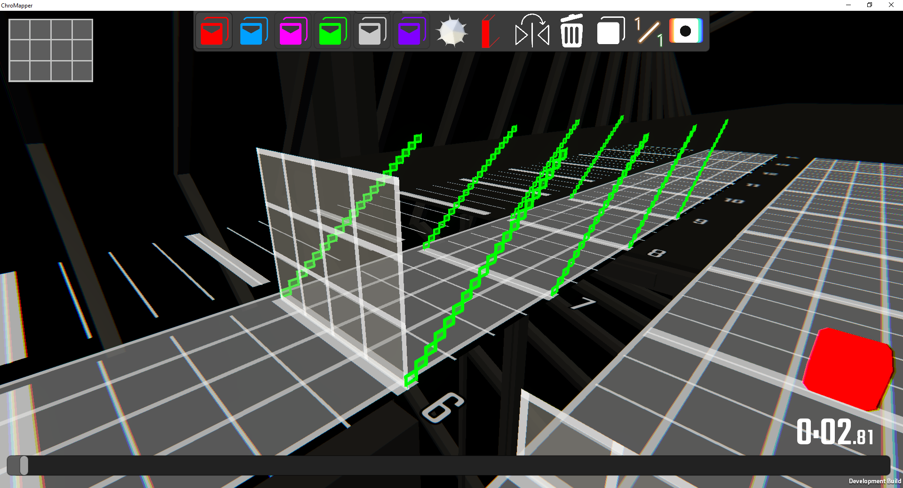
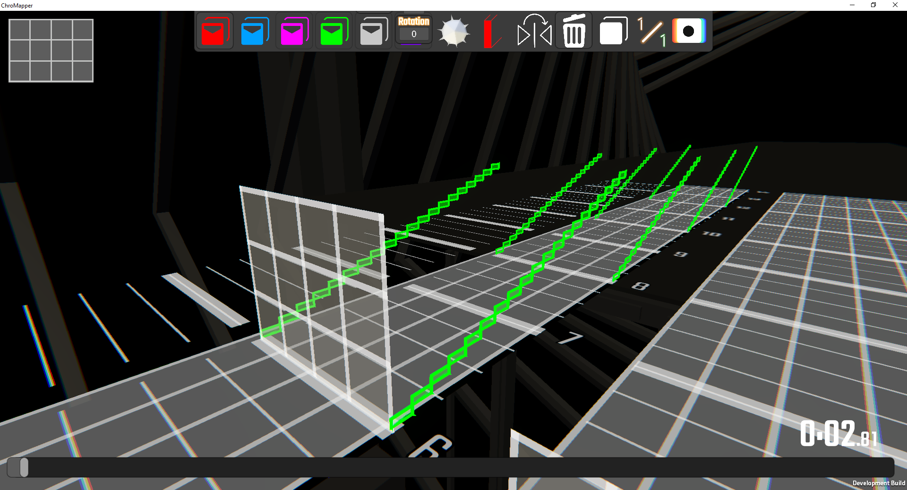
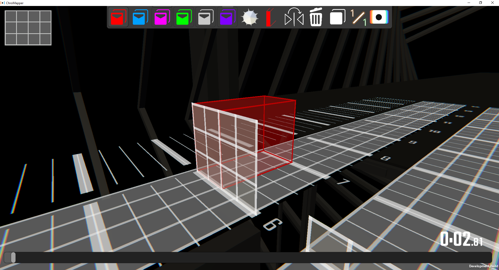
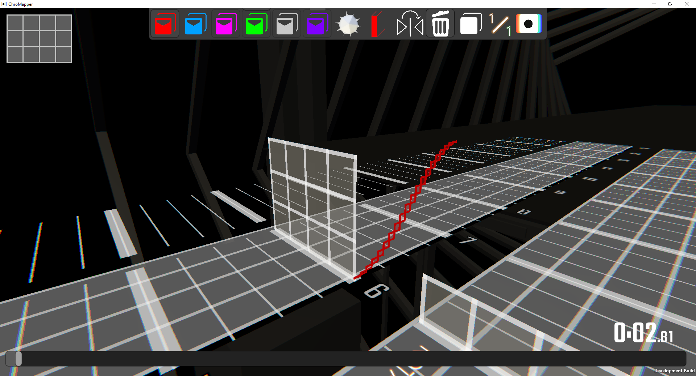

# Quickstart

Ever played a wallmap and thought.


__OH BOY DO I HAVE THE TOOL FOR YOU__

__Beatwalls__ is a program designed to make wallmaps with thousands of wall possible.
It tries to make them __easy and fast__ to create and change.
It is not however the tool if you are looking for spelling, 3d modelling or animations.
For that check out [Nyri0s scripts](https://github.com/Nyrio/beat-saber-mapping-scripts/tree/7456bedb00371914ed27e28ebc3cf28f0b4b42e5)

While i have your full attention, I want to thank these people:
- Bloodcloak, who put up with my spelling and helped me write this documentary.
- Aero, who wrote Noodle Extensions and 
- CheckThePan and nyri0, who helped me with a lot of math
- Reaxt and CyanSnow who showed us what can be possible with modcharts
- +1Rabbit, who is really nice and helped me a ton with his code :)

## Installation

### Tools

- install [java](https://java.com/en/download/)
- install [mma2](https://bsmg.wiki/mapping/mediocre-map-assistant.html#editor-setup)
- download [beatwalls](https://github.com/spookyGh0st/beatwalls/releases/)

### mods
::: tip Info
can be installed through modAssistant, 
or [manually](https://bsmg.wiki/pc-modding.html#install-mods)
:::

- required: [Noodle Extension](https://github.com/Aeroluna/NoodleExtensions) - allows for wallmaps
- recommended: [Chroma](https://github.com/Aeroluna/chroma) - lets you color your walls
- highly recommended: [FPFCToggle and Songcontrol](https://github.com/Auros/SiraUtil#songcontrol) - lets you look at the map without vr
- ~~highly recommended:~~ currently not working [ReLoader](https://github.com/Kylemc1413/ReLoader) - hot reloads the map from the pause menu
- highly recommended: [PracticePlugin](https://github.com/Kylemc1413/PracticePlugin) - change Song time, playback speed and more from the pause manu

## Setup

It is __highly__ recommended using a sepate difficulty for your generated Walls.
This difficulty will hold all the Elements that are being created.
For that, it will need the requirement `Noodle Extensions` or `Mapping Extensions` as well as `Chroma`.
You can learn on how to set up the map in the [bsmg.wiki](https://bsmg.wiki/mapping/extended-mapping.html#set-up).

::: warning Info
currently you have to copy the walls into the final version manually with json editing.
::: 

## Usage

Drag a Song Folder into the .exe to launch the configuration setup. 
It will create the main.bw File in your song folder. Open this in any text editor, I recommended Visual Studio Code.
This File defines the created Structures for the selected difficulty, like a cookbook.

Once beatwalls is running, it will listen to all changes to the main.bw file.
So whenever you change a section and hit save, it will create the new walls.

After the program has been set up, it can be started again simply by double clicking the .exe.
When you want to change the map, drag the new song folder in the application and repeat the setup.

::: danger
Beatwalls will replace **ALL NOTES, OBSTACLES AND EVENTS** in the difficulty.
Don't edit those manually, as they will be overwritten.
:::

## Overview

### WallStructure 

A Structure is a collection of walls ~~Notes or lights~~ (planned for the future).
Bundling them together allows one to  edit and repeat them all at once to fit the Song, without having to manually edit each wall. 

### Coordinate System

To make working with Walls easier, I introduce to you a new [standard](https://xkcd.com/927) of Values, which define a wall. It defines 1 = one block.



A wall is defined by `x,y,z,width,height,duration`.
The Position is in the **center** of the Wall.



::: tip Info
`z` and `duration` are measured in beats.
Look at a different mapper (mma2) for those.
:::

# Let's get started! 

## Basic Properties

Now let`s create our first Structure  
Open Beatwalls and leave it running.  
Inside your map folder, there should be a main.bw file now. Open it up and the wall mapping can begin! 
We will start with some basic Structure Properties; Let's create a simple line first, that moves from right to left.

```yaml
# creates a Line at beat 4 that moves from bottom right to bottom left
Line:
    beat: 4
    p0: 2, 0
    p1: -2, 0
```

Lets see what happens in this example
 * Lines starting with a `#` are comments and get ignored.
 * `Line` creates a Line Structure 
 * `beat: 4` makes the Line spawn in on Beat 4
 * `p0: 2, 0` will make the Line start at X=2 and Y=0
 * `p1: -2, 0` will make the Line end at X=-2 and Y=0
 * We did not set a duration, thus the Structure will default to 1 beat
 
Let's see how it turned out:


 
::: warning Timing
Beatwalls automatically makes sure your Structures __appear__ and not zoom past you at the specific beat. This is why the Walls are located on beat 6 (Half Jump Duration is 2 for this example).
::: 

## Gotchas before we move on

- Beatwalls is ***NOT*** case-sensitive
- Beatwalls does ***NOT*** care about spaces or tabs but it does care about newlines
- Beatwalls works with BEATS (the thing in mm) and not TIMES, it takes care of the bpm changes found in mma2
- Beatwalls has ***NO*** complete Syntax checker currently and might crash when something weird happens. Please write me when it does.

## Back to the Line

 We will go for a different line now and we want to use more walls for it this time aswell.

```yaml
# creates a Line at beat 4 that moves from bottom right to top right
Line:
    beat: 4
    p0: 2, 0
    p1: 2, 3
    amount: 20
    duration: 1 #for later purposes
```
We now changed the Line's point-positions and forced it to use exactly 20 walls. The result:


Pretty neat, right? Now let's use the mirror property and maybe also change the color of our structure's walls. We want to mirror on the Y Axis so we will use mirror value 2.

```yaml
# creates a Line at beat 4 that moves from bottom right to top right and mirrors it to the other side
Line:
    beat: 4
    p0: 2, 0
    p1: 2, 3
    amount: 20
    color: green
    mirror: 2
    duration: 1
```
Coloring can be done by typing an already [existing color](https://docs.oracle.com/javase/7/docs/api/java/awt/Color.html) or by using RGB Values: __0-255,0-255,0-255__.  
Our current result:



::: tip Why mirror: 2?
Mirroring allows to mirror on multiple axises and so on. If you want to know which value means what, you can hit up the References Documentation and check on the mirror property [here](https://spooky.moe/beatwalls/reference/beatwalls/structure.wallStructures/-line/). You will also find all other adjustable properties for each structure there.
:::

## Introducing Variables / Repeating Structures

Now what do I do, if I want to have a structure repeat itself? It would be quiet the hassle to copy paste everytime wouldn't it? So this is where the property __repeat__ and it's corresponding variable __r__ come into play.  
We will now make the structure repeat itself 4 times:

```yaml
Line:
    beat: 4 + r #Each repeated Structure starts on a different beat
    p0: 2, 0
    p1: 2, 3
    amount: 20
    color: green
    mirror: 2
    duration: 1
    repeat: 4
```
Repeating a structure on its own will cause all repetitions to start all at the same beat. To prevent this, we will tell __beat__ to adjust to our repetition amount. The value __r__ will increase by 1 for each repetition it has been through starting at r=0. (This variable can be used to adjust any kind of property, not just beat)  
We now get this: 


Now what will happen if we change our structure's __duration__? Simply adding __r__ to the beat will not work anymore because our structures will be interfering with eachother again. To prevent this issue __duration__ also has a corresponding variable __d__.  
To fix our issue we simply type the following:

```yaml
Line:
    beat: 4 + r*d #r will now increase by the value of duration
    p0: 2, 0
    p1: 2, 3
    amount: 20
    color: green
    mirror: 2
    duration: 2
    repeat: 4
```
And our final result looks like this:


:::tip Reminder
As you can probably already tell, these were just a small amount of property changes that you can do with beatwalls. We will go into more advanced changes later in the guide but if you are already curious: You can navigate through all structures and their properties [here](https://spooky.moe/beatwalls/reference/beatwalls/structure.wallStructures/)
:::

# Structures
Beatwalls doesn't just allow you to place single lines of walls, you can choose from a bigger list of available structures and also create your own! In this segment we will go over all the available Structures, how they look and what key-properties you will need for them to get working.

## Wall

Pretty self explanatory actually, this Structure is basically just a single wall. You will determine its location by putting X,Y,Z values for p0 and p1 as the corners of the wall. Remember that the value of Z will count as amount of beats.  
Example:
```yaml
Wall:
    beat: 4
    p0: 0, 0, 0
    p1: -2, 3, 1
```


## Line

We already discussed this one in the [Basic Properties](#basic-properties) part of the Guide but just for completion: A Line Structure will create a line of walls beginning at p0: X,Y and ending at p1: X,Y. The Z value will be determined by setting a duration (defaults to 1).

## Curve

Curve will create a curve of walls that is running through all given points. You can set 8 specific points max but you will have to put at least 2 (even tho that will result in a Line).  
Our example here will create a bouncy one:
```yaml
Curve:
    beat: 4
    p0: 2, 0
    p1: 2, 3
	p2: 2, 0
	amount: 20
```


## BezierCurve

Now this is a more complex Curve. It is defined by 4 points exactly. The exact behavior of a Bezier Curve can be simulated over this [Website](https://www.desmos.com/calculator/cahqdxeshd). The points for this curve act as the following:  
__p0__: Start of the Curve  
__p1__: First stretching-point / manipulates in favor of p0 (stretches curve into its direction)  
__p2__: Second stretching-point / manipulates in favor of p3 (stretches curve into its direction)  
__p3__: End of the Curve  
The Z value of the stretching point will be exactly inbetween starting and ending point (The Z value will hopefully be adjustable in the future again).  
Using this Curve allows for cool rising effects. In this example we will go for a curve that slowly starts rising but also slows down on approaching its ending point:
```yaml
BezierCurve:
    beat: 4
    p0: 2, 0
    p1: 2, 0
	p2: 2, 3
    p3: 2, 3
	amount: 20
```
